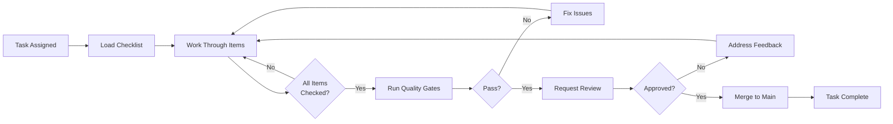

# Development Checklists

**Purpose:** Ensure quality and completeness for every development task  
**Audience:** Developers (human and AI agents)  
**Enforcement:** Pre-commit hooks + AI agent reminders + Code reviews

---

## 📋 Available Checklists

### 1. [API Endpoint Checklist](./api-endpoint.md)
**When to use:** Creating or updating backend API endpoints

**Key sections:**
- Backend implementation (routes, services, validation)
- Swagger/OpenAPI documentation
- Unit tests (>80% coverage)
- Bruno API testing
- Security & performance
- Quality gates

**Typical time:** 2-4 hours per endpoint

---

### 2. [React Component Checklist](./react-component.md)
**When to use:** Creating or updating React components

**Key sections:**
- Component implementation (functional, hooks)
- Clean architecture compliance (no business logic in components)
- Component tests (>80% coverage)
- Styling & accessibility
- Performance optimization
- Quality gates

**Typical time:** 1-3 hours per component

---

### 3. [Database Change Checklist](./database-change.md)
**When to use:** Modifying database schema or creating migrations

**Key sections:**
- Prisma schema design
- Indexes & constraints
- Migration creation & testing
- Rollback migration
- Prisma Client generation
- Performance benchmarking

**Typical time:** 1-2 hours per migration

---

### 4. [Feature Completion Checklist](./feature-complete.md)
**When to use:** Before marking a feature as "Done" and merging to main

**Key sections:**
- Implementation complete (FE, BE, DB)
- Testing complete (unit, integration, manual)
- Documentation complete (code, user, technical)
- Quality standards met
- Accessibility
- Production readiness
- Team review

**Typical time:** 30-60 minutes for review

---

## 🚀 How to Use These Checklists

### For Human Developers

1. **Before starting work:**
   - Read the appropriate checklist
   - Understand all requirements
   - Ask questions if unclear

2. **During development:**
   - Work through checklist items sequentially
   - Check off items as you complete them
   - Don't skip items

3. **Before committing:**
   - Verify all items are checked
   - Run quality gates (tests, lint, type-check)
   - Commit only when 100% complete

---

### For AI Agents

1. **Load checklist at task start:**
   ```
   Read: .ai/checklists/<task-type>.md
   ```

2. **Follow checklist step-by-step:**
   - Complete each item in order
   - Mark checkboxes as you go
   - Document any skipped items with reason

3. **Before marking task complete:**
   - Verify ALL checkboxes checked
   - Run automated validations
   - Self-review code quality
   - Prepare handoff documentation

4. **Handoff protocol:**
   - State what was completed
   - Reference checklist items
   - Note any blockers or dependencies
   - Specify next agent if applicable

---

## 🔒 Enforcement Levels

### Layer 1: Pre-commit Hooks (Blocking)
Automated validation in `.husky/pre-commit-checklist.js`:

- ✅ New API endpoint → Must have tests
- ✅ New React component → Must have tests
- ✅ Database schema change → Must have migration
- ❌ Violations BLOCK the commit

### Layer 2: AI Agent Reminders
AI agents MUST:
- Load relevant checklist before starting task
- Follow checklist items sequentially
- Mark task complete ONLY when ALL items checked
- Request human review for quality gates

### Layer 3: Code Review
Human reviewers verify:
- Checklist items completed
- Quality standards met
- Documentation updated
- Tests passing

---

## 📊 Checklist Completion Tracking

### Status Indicators

- [ ] **Not Started** - Task not begun
- [~] **In Progress** - Some items complete
- [✓] **Complete** - All items checked
- [!] **Blocked** - Cannot proceed, needs help

### Example Task Status

```markdown
### Task: Implement /api/media/:id endpoint

**Checklist:** api-endpoint.md
**Status:** In Progress (15/20 items)

Progress:
- [✓] Backend implementation
- [✓] Documentation
- [~] Testing (6/8 tests done)
- [ ] Bruno API testing
- [ ] Quality gates

Blocker: None
ETA: 1 hour
```

---

## 🎯 Quality Gates

Features CANNOT be merged if:

### Critical (Always Blocking)
- ❌ Tests failing
- ❌ TypeScript errors
- ❌ ESLint errors
- ❌ Security vulnerabilities
- ❌ Missing required documentation
- ❌ No code review

### Important (Should Block)
- ⚠️  Code coverage <80%
- ⚠️  Performance regressions
- ⚠️  Accessibility violations
- ⚠️  Breaking changes without migration plan

### Advisory (Can Defer)
- 💡 Minor code style issues
- 💡 Opportunities for refactoring
- 💡 Additional test coverage
- 💡 Documentation improvements

---

## 🔄 Checklist Workflow



---

## 📚 Related Documentation

### Core Instructions
- `.github/instructions/frontend.instructions.md` - Frontend patterns
- `.github/instructions/backend.instructions.md` - Backend patterns
- `.github/instructions/react-clean-architecture.instructions.md` - Architecture
- `.github/instructions/api-standards.instructions.md` - API standards
- `.github/instructions/database.instructions.md` - Database patterns
- `.github/instructions/testing.instructions.md` - Testing strategies

### Process & Coordination
- `CONTRIBUTING.md` - Contributing guidelines
- `.github/instructions/agentic-coordination.instructions.md` - Multi-agent workflows
- `.github/instructions/git-workflow.instructions.md` - Git conventions

### Quality
- `.github/instructions/code-quality.instructions.md` - Code standards
- `.github/instructions/security.instructions.md` - Security practices
- `.github/instructions/performance.instructions.md` - Performance optimization

---

## 🛠️ Customizing Checklists

### Adding New Checklists

1. **Create new file:** `.ai/checklists/<task-type>.md`
2. **Follow template structure:**
   - ✅ Checklist Items (categorized)
   - 🤖 AI Agent Instructions
   - 📋 Pre-commit Validation
   - 📊 Example Usage
   - 🚨 Common Mistakes
   - 🔗 Related Documentation

3. **Update this README** with new checklist

### Modifying Existing Checklists

1. **Review with team** before major changes
2. **Update version number** at bottom of file
3. **Document changes** in checklist file
4. **Notify AI agents** of important updates

---

## 💡 Tips for Success

### Do's ✅
- ✅ Read entire checklist before starting
- ✅ Check items off as you complete them
- ✅ Ask for help if stuck
- ✅ Run quality gates before committing
- ✅ Request code review when complete

### Don'ts ❌
- ❌ Skip checklist items
- ❌ Check off items you didn't do
- ❌ Commit without running tests
- ❌ Merge without code review
- ❌ Rush through quality gates

---

## 📈 Metrics & Improvements

### Track
- Time to complete each checklist type
- Most common blocking issues
- Items frequently skipped
- Quality gate pass/fail rates

### Improve
- Update checklists based on lessons learned
- Automate repetitive checks
- Simplify complex items
- Add examples and clarifications

---

## 🤝 Contributing to Checklists

Found an issue or have a suggestion?

1. **Open an issue:** Describe the problem or suggestion
2. **Propose changes:** Submit a PR with checklist updates
3. **Discuss with team:** Get consensus on changes
4. **Document updates:** Update version and changelog

---

**Last Updated:** 2026-02-13  
**Version:** 1.0.0  
**Maintained By:** Development Team + AI Agents
