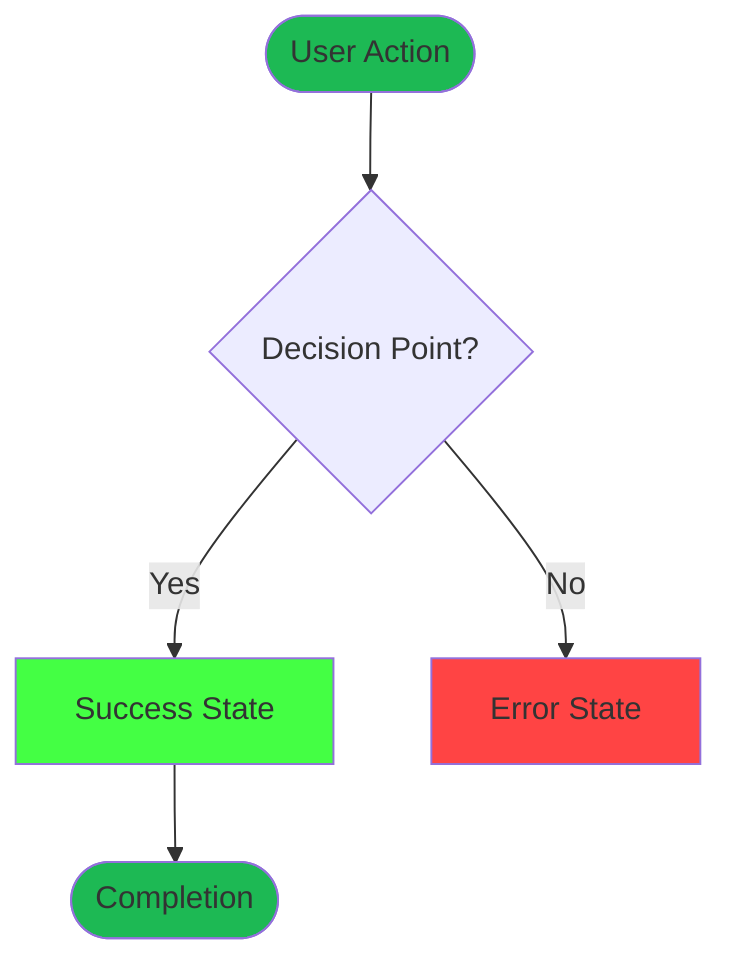
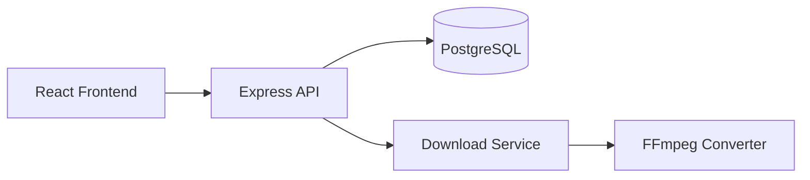
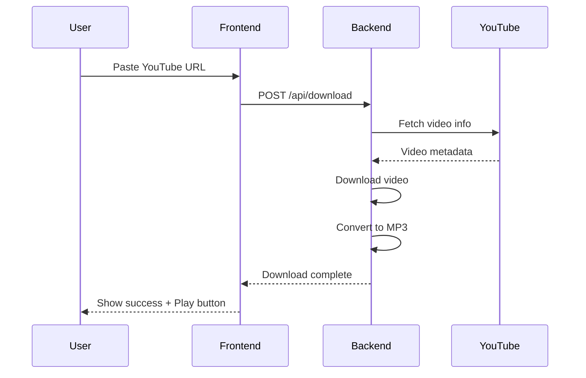
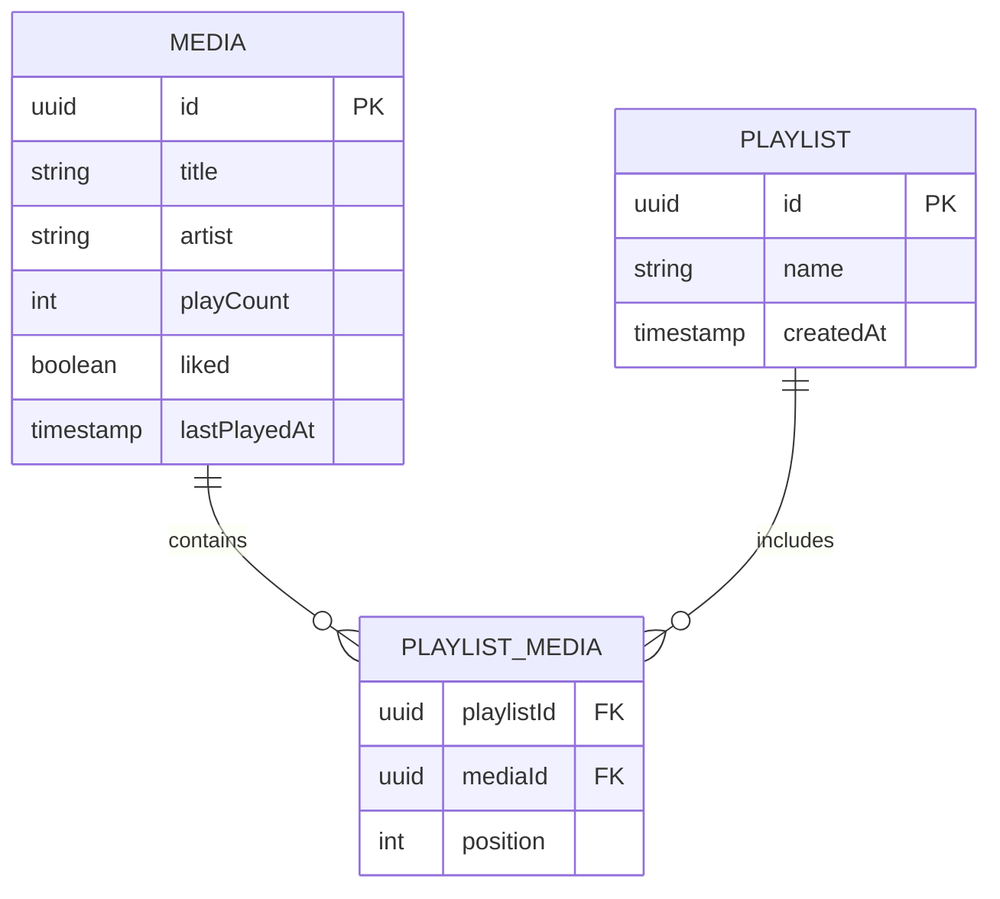
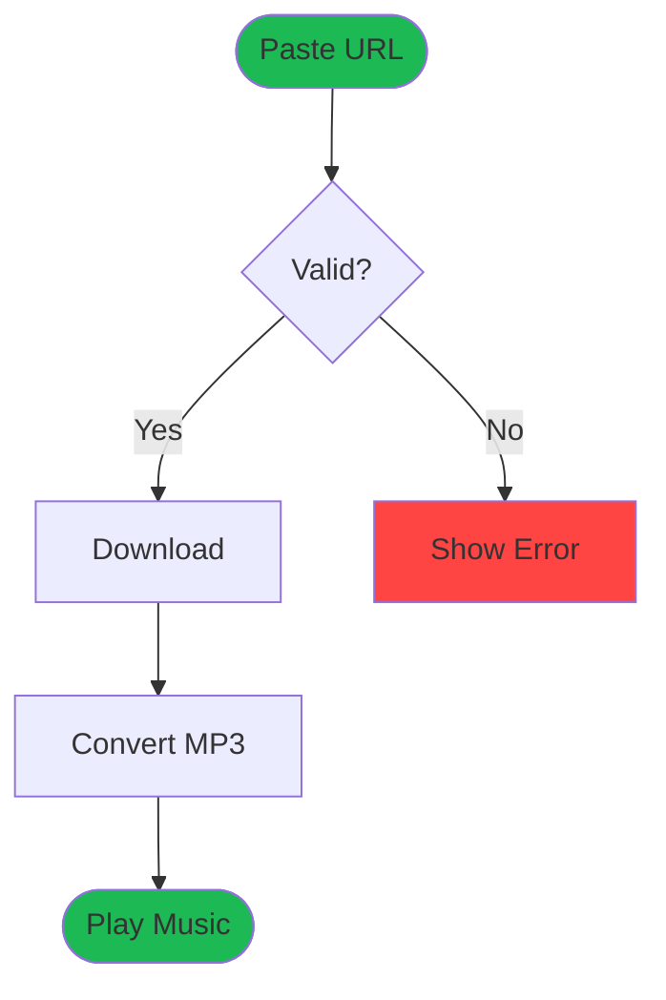
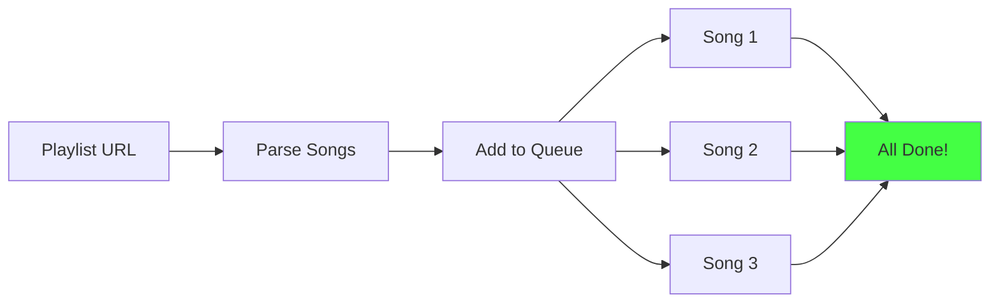

# Mermaid Diagrams Instructions

## 🎨 Purpose
This guide explains how to create and use Mermaid diagrams for visualizing flows, architecture, and user journeys in this project.

---

## 🔧 Setup

### VS Code Extension (Recommended)
```bash
# Install via VS Code Extensions
# Search: "Mermaid Chart" or "ms-vscode.copilot-mermaid-diagram"
```

**Benefits:**
- Live preview of diagrams
- Syntax highlighting
- Integration with Copilot Chat (@mermAId participant)
- Export to PNG/SVG

### GitHub Copilot CLI
- Copilot automatically understands Mermaid syntax
- Use @mermAId in Copilot Chat to generate/edit diagrams
- Example: `@mermAId create a flowchart for user authentication`

---

## 📊 Diagram Types Used in This Project

### 1. **User Flow Diagrams** (graph TD)
**Use for:** User journeys, user interactions, UX flows



**Color Convention:**
- **Start/End states:** `#1DB954` (Spotify green - brand color)
- **Success states:** `#44ff44` (bright green)
- **Error states:** `#ff4444` (red)
- **Warning states:** `#ff9944` (orange)
- **Info states:** `#4444ff` (blue)

---

### 2. **Architecture Diagrams** (graph LR)
**Use for:** System architecture, component relationships



---

### 3. **Sequence Diagrams**
**Use for:** API calls, service interactions, time-based flows



---

### 4. **Entity Relationship Diagrams**
**Use for:** Database schemas, data models



---

## 🎯 When to Create Diagrams

### **MUST HAVE:**
1. **User flows** for each major feature
2. **Architecture diagrams** for system overview
3. **Database schema** (ERD)
4. **API sequence diagrams** for complex interactions

### **NICE TO HAVE:**
5. State machines for player controls
6. Component hierarchy diagrams
7. Deployment architecture

---

## 📝 Diagram Guidelines

### Naming Conventions
- **Nodes:** Use descriptive, action-oriented names
  - ✅ "User Clicks Download"
  - ❌ "Click"
- **Decision nodes:** Frame as questions
  - ✅ "URL Valid?"
  - ❌ "Validation"

### Keep It Simple
- Max 20-30 nodes per diagram
- Break complex flows into multiple diagrams
- Use subgraphs for logical grouping

### User-Focused Language
- Write from user perspective
- Include emotions (😊 😩 🎉) for empathy
- Show thinking/feeling at key stages

### Special Characters & Paths
- **Forward slashes (/):** Must use double quotes
  - ❌ `[/Music/Playlist/songs]`
  - ✅ `["Music/Playlist/songs"]`
  - ✅ `["Organize by Playlist<br/>Music/Playlist/songs"]`
- **Line breaks in quoted strings:** Use `<br/>`
- **Special chars:** Use double quotes `["text with / or \"]`

---

## 🔄 Generating Diagrams with Copilot

### Using @mermAId Participant (VS Code)

```
You: @mermAId create a flowchart showing the bulk download process

Copilot: [generates Mermaid diagram]

You: @mermAId add error handling for failed downloads

Copilot: [updates diagram with error branches]
```

### Prompts That Work Well

**User Flows:**
```
Create a Mermaid flowchart for the user journey when:
- Exporting music to USB drive
- Searching local library
- Creating a new playlist
```

**Architecture:**
```
Generate a Mermaid diagram showing:
- Frontend → Backend → Database architecture
- Service layer components
- Docker container relationships
```

**Sequences:**
```
Show a sequence diagram for:
- WebSocket download progress updates
- Authentication flow
- File upload process
```

---

## 📍 Where Diagrams Live

### Current Locations:
1. **User Flow Diagrams:** `.github/instructions/ux-design.instructions.md`
   - All 4 user journey flows with Mermaid
   
2. **Architecture Diagrams:** `.github/instructions/architecture.instructions.md`
   - System architecture (coming soon)
   - Layer diagrams (coming soon)

3. **Database Schema:** `.github/instructions/database.instructions.md`
   - ERD diagrams (coming soon)

### Future Additions:
- `docs/diagrams/` - Standalone diagram files
- `README.md` - High-level architecture
- API documentation - Sequence diagrams

---

## 🖼️ Exporting Diagrams

### From VS Code (vscode-mermAId)
1. Open diagram in preview
2. Click "Export" button
3. Choose format: PNG, SVG, PDF
4. Save to `docs/images/` folder

### From GitHub
- GitHub auto-renders Mermaid in markdown
- Right-click diagram → Save image

### For Documentation
- Keep source code in `.md` files
- Export to images for presentations
- Include both in documentation

---

## 🎨 Style Guide

### Colors (Match Brand)
```javascript
// Primary colors
Brand Green: #1DB954 (Spotify-like)
Success: #44ff44
Error: #ff4444
Warning: #ff9944
Info: #4444ff

// Backgrounds
Dark: #121212
Medium: #282828
Light: #404040

// Text
White: #FFFFFF
Gray: #B3B3B3
Dim: #6A6A6A
```

### Node Shapes
- **Rounded rectangles:** `[Action]` - Standard actions
- **Stadium:** `([Start/End])` - Start/end states
- **Diamond:** `{Decision?}` - Decision points
- **Circle:** `((Event))` - Events/milestones
- **Cylinder:** `[(Database)]` - Data stores

---

## 📚 Examples from This Project

### Example 1: Simple Download Flow


### Example 2: Bulk Download with Progress


---

## 🔗 Resources

### Official Documentation
- [Mermaid Live Editor](https://mermaid.live) - Test diagrams online
- [Mermaid Documentation](https://mermaid.js.org) - Full syntax reference
- [VS Code Extension](https://marketplace.visualstudio.com/items?itemName=ms-vscode.copilot-mermaid-diagram)

### GitHub Integration
- [GitHub Mermaid Support](https://docs.github.com/en/get-started/writing-on-github/working-with-advanced-formatting/creating-diagrams)
- Automatically renders in README, issues, PRs, docs

### Copilot Resources
- [Microsoft vscode-mermAId](https://github.com/microsoft/vscode-mermAId)
- Use @mermAId in Copilot Chat for AI-powered diagram generation

---

## ✅ Best Practices

### DO:
✅ Color-code by state (success, error, warning)  
✅ Keep diagrams focused (one feature per diagram)  
✅ Use consistent naming conventions  
✅ Include user emotions in UX flows  
✅ Update diagrams when features change  
✅ Version control diagram source code  

### DON'T:
❌ Create overly complex diagrams (>30 nodes)  
❌ Mix different diagram types in one chart  
❌ Use abbreviations without context  
❌ Forget to add colors for readability  
❌ Export without keeping source code  
❌ Create diagrams without purpose  

---

## 🚀 Quick Start Checklist

When adding a new feature:

- [ ] Create user flow diagram
- [ ] Add to ux-design.instructions.md
- [ ] Color-code states (success/error/warning)
- [ ] Test rendering in VS Code preview
- [ ] Commit source code (not just images)
- [ ] Reference in feature documentation
- [ ] Update architecture diagram if needed

---

**Note:** All Mermaid diagrams in this project use the Spotify green (#1DB954) as the primary brand color to maintain visual consistency with the UI design system.
