```mermaid
graph TD
    Start([User Opens App<br/>First Time]) --> Discovery{Found YouTube<br/>Song}
    
    Discovery -->|Excited| Onboarding[See Welcome Screen<br/>'Download music from YouTube']
    
    Onboarding --> PasteURL[Paste YouTube URL<br/>in input field]
    
    PasteURL --> ClickDownload[Click 'Download' Button]
    
    ClickDownload --> ValidateURL{URL Valid?}
    
    ValidateURL -->|No| Error[Show Error:<br/>'Invalid YouTube URL']
    Error --> PasteURL
    
    ValidateURL -->|Yes| StartDownload[Start Download<br/>Show Progress Bar]
    
    StartDownload --> Downloading[Downloading...<br/>75% complete<br/>10 seconds remaining]
    
    Downloading --> Converting[Converting to MP3...]
    
    Converting --> Complete[Download Complete!<br/>Success Animation]
    
    Complete --> AutoNavigate[Auto-navigate to<br/>Downloaded Song]
    
    AutoNavigate --> ShowPlayer[Show Player with<br/>Big Play Button<br/>Offline Indicator]
    
    ShowPlayer --> FirstPlay[User Clicks Play]
    
    FirstPlay --> Playing([Music Playing!<br/>User Delighted 🎉])
    
    Playing --> SuggestPlaylist[Suggest: Create<br/>Your First Playlist?]
    
    SuggestPlaylist -->|Yes| CreatePlaylist[Create Playlist Flow]
    SuggestPlaylist -->|Later| Activated([User Activated!])
    
    style Start fill:#1DB954
    style Playing fill:#1DB954
    style Activated fill:#1DB954
    style Error fill:#ff4444
    style Complete fill:#44ff44
```

# UX/UI Design Instructions

## 👥 User Personas

### Primary: Alex - Music Enthusiast
**Demographics:**
- Age: 25-35
- Tech-savvy, comfortable with apps
- Daily Spotify/YouTube Music user
- Limited mobile data plan

**Goals:**
- Build comprehensive offline music library from YouTube
- Discover new music from YouTube recommendations
- Save data by downloading at home WiFi
- Have music available during commute (no signal areas)

**Pain Points:**
- Streaming uses too much mobile data
- No internet during subway commute
- YouTube ads interrupt listening
- Can't save YouTube mixes offline legally

**Needs:**
- Fast, reliable YouTube downloads
- Good audio quality (192+ kbps)
- Search within local library
- Create custom playlists from downloads

**Usage Scenarios:**
1. Downloads 10-15 songs weekly from YouTube
2. Listens 1-2 hours daily during commute
3. Creates themed playlists (workout, chill, focus)
4. Shares song recommendations with friends

**Quote:** *"I found this amazing YouTube playlist but I can't stream it on the subway. I need to download the whole thing!"*

---

### Secondary: Jamie - Casual Listener
**Demographics:**
- Age: 18-24
- Limited technical knowledge
- Occasional music listener
- Prefers simple, intuitive apps

**Goals:**
- Listen to favorite songs offline
- No complicated setup
- Just want music to work
- Minimal effort to get started

**Pain Points:**
- Overwhelmed by complex apps
- Doesn't understand technical jargon
- Gets confused by too many options
- Frustrated by failed downloads

**Needs:**
- Simple, clear interface
- One-click downloads
- Obvious play button
- Minimal configuration needed

**Usage Scenarios:**
1. Downloads 2-3 favorite songs
2. Listens occasionally (background music)
3. Rarely creates playlists
4. Prefers "just works" experience

**Quote:** *"I just want to download a song and play it. Why is this so complicated?"*

---

### Tertiary: Morgan - Multi-Device User
**Demographics:**
- Age: 30-45
- Tech enthusiast, multiple devices
- Uses car audio system, portable MP3 player, phone
- Values portability and device independence

**Goals:**
- Build large music collection (100s of songs)
- Transfer music to multiple devices
- Download entire playlists/albums at once
- Sync music to car system without internet

**Pain Points:**
- Single-song downloads are too slow
- Can't easily move music to other devices
- No way to download entire playlists
- Manual file management is tedious

**Needs:**
- Bulk download (playlist, album, artist)
- Export to USB/SD card
- Transfer to phone/music player
- Organize by playlist for easy export

**Usage Scenarios:**
1. Download favorite artist's discography (50+ songs)
2. Export playlist to USB for car stereo
3. Transfer new downloads to portable player
4. Backup entire library to external drive

---

## 🗺️ User Journey Maps

### Journey 0: First-Run Legal Acceptance (ALL Users - REQUIRED)

> **Critical:** This journey happens BEFORE any other feature access. Users MUST accept Terms & Conditions before using the app.

#### Stage 1: App Launch (First Time)
**What they're doing:** Opening the application for the first time  
**Thinking:** "Let's see what this app can do"  
**Feeling:** 😊 Curious, eager to explore  
**System Action:**
- Check localStorage for `legal-consent-accepted`
- If not found → Show legal modal (blocks all other UI)
- If found → Skip to main app

**UI State:**
- Full-screen modal overlay (cannot be dismissed)
- Blurred/dark background
- No access to app features until acceptance

#### Stage 2: Reading Legal Terms
**What they're doing:** Reviewing Terms of Service and Disclaimer  
**Thinking:** "What am I agreeing to? Is this safe? What are my responsibilities?"  
**Feeling:** 🤔 Cautious, reading carefully  
**Pain Points:**
- Legal text is boring/overwhelming
- Want to use app but must read terms
- Concerned about legal implications
- May not understand all legal language

**Opportunity:**
- Make legal terms clear and scannable
- Use ✅/❌ formatting for easy comprehension
- Highlight user responsibilities
- Link to full docs for detailed reading
- Show "why this matters" context

**UI Requirements:**
- Scrollable content area with legal text
- Prominent warnings in yellow/red
- Clear sections: "What you agree to", "What we don't do", "Your responsibilities"
- Links to DISCLAIMER.md and LICENSE (open in new tab)
- Visual hierarchy (headers, bullet points, emphasis)

#### Stage 3: Acknowledging Responsibilities
**What they're doing:** Checking required checkboxes  
**Thinking:** "I understand I'm responsible for my downloads. I won't violate YouTube ToS."  
**Feeling:** 🤷 Accepting responsibility, ready to proceed  
**Interactions:**
- [ ] Read and understand Legal Disclaimer
- [ ] Read GPL-3.0 License
- [ ] Acknowledge sole responsibility for legal use

**UI Requirements:**
- 3 checkboxes (ALL required before proceeding)
- Each checkbox has label with linked documentation
- Final checkbox emphasizes user responsibility (bold/highlighted)
- "I Accept" button disabled until all checked
- Clear visual feedback when hovering disabled button

**Validation:**
- ALL 3 checkboxes must be checked
- "I Accept" button grayed out until complete
- Tooltip explains why button is disabled
- Cannot bypass or skip this step

#### Stage 4: Decision Point
**What they're doing:** Deciding whether to accept or decline  
**Thinking:** "Do I agree to these terms? Can I trust this tool?"  
**Feeling:** 🤔 Weighing options  
**Actions Available:**
- **Accept:** Proceed to main app (preferred path)
- **Decline:** Exit application (safety valve)

**UI Requirements:**
- Two action buttons:
  - "Decline & Exit" (left, gray, secondary)
  - "I Accept - Continue" (right, blue, primary)
- Decline shows confirmation: "Declining will close the application"
- Accept only enabled when all checkboxes checked
- Clear visual distinction between actions

#### Stage 5: Acceptance & Entry
**What they're doing:** Clicking "I Accept - Continue"  
**Thinking:** "Okay, I understand my responsibilities. Let's use the app!"  
**Feeling:** ✅ Confident, ready to explore  
**System Action:**
- Store acceptance in localStorage:
  - `legal-consent-accepted: "1.0.0"`
  - `legal-consent-date: "2026-02-13T22:30:00Z"`
  - `legal-consent-user-agent: "Mozilla/5.0..."`
- Log acceptance event (analytics, if enabled)
- Close modal
- Show main application interface

**Post-Acceptance:**
- Never show modal again (unless ToS version upgraded)
- User can review terms in Settings → Legal
- User can revoke consent (forces app restart)

#### Error Cases & Edge Cases

**Case 1: User clicks Accept without checking boxes**
- Show alert: "Please check all required boxes before proceeding"
- Keep modal open
- Highlight unchecked boxes

**Case 2: User closes browser tab/window**
- Consent NOT saved
- Modal shows again on next visit

**Case 3: Terms updated (version 1.0.0 → 1.1.0)**
- Stored version doesn't match current
- Modal shown again (forced re-acceptance)
- Previous acceptance date preserved for records

**Case 4: User clicks links to DISCLAIMER.md/LICENSE**
- Open in new browser tab
- Modal stays open in background
- User can read full terms, then return to accept

**Case 5: User clicks "Decline & Exit"**
- Show confirmation dialog
- If confirmed → window.close() or redirect to about:blank
- Consent NOT saved

#### Success Metrics
- **Acceptance Rate:** % of users who accept vs decline
- **Time to Accept:** How long users spend reading terms
- **Checkbox Completion:** Which checkboxes get checked first
- **Link Clicks:** Do users click to read full DISCLAIMER.md?

#### Accessibility Requirements
- Keyboard navigation (Tab through checkboxes, Enter to accept)
- Screen reader compatible
- High contrast text (WCAG AA)
- Focus indicators on interactive elements
- Clear error messages

#### Mobile Considerations
- Modal fits mobile screens (max-height: 95vh)
- Scrollable content (long legal text)
- Touch-friendly checkboxes (larger tap targets)
- Stack buttons vertically on small screens
- Readable font size (min 14px)

---

### Journey 1: Download & Play First Song (New User - Alex)

#### Stage 1: Discovery
**What they're doing:** Found a song on YouTube they want offline  
**Thinking:** "I love this song, I need it for my commute"  
**Feeling:** 😊 Excited, motivated  
**Pain Points:**
- Never used this app before
- Uncertain if it will work
- Worried about quality/legality

**Opportunity:**
- Clear onboarding: "Download music from YouTube to play offline"
- Simple first-time setup
- Trust signals (how it works, privacy)

#### Stage 2: First Download
**What they're doing:** Pasting YouTube URL into app  
**Thinking:** "Will this actually work? How long will it take?"  
**Feeling:** 🤞 Hopeful but cautious  
**Interactions:**
- Open app → See "Paste YouTube URL" input
- Paste link → Click "Download"
- See progress bar with percentage
- Get notification when complete

**UI Requirements:**
- Prominent "Paste YouTube URL" field
- Clear "Download" button
- Real-time progress indicator
- Success confirmation with play button

**Progress UI:**
```
Downloading: "Song Title - Artist Name"
━━━━━━━━━━━━░░░░░░░░ 75%
Estimated: 10 seconds remaining

Converting to MP3... 🎵
```

#### Stage 3: First Play
**What they're doing:** Playing their first downloaded song  
**Thinking:** "It works! This is great!"  
**Feeling:** 🎉 Delighted, accomplished  
**Pain Points:**
- Can't find the downloaded song
- Player controls unclear
- No indication it's playing offline

**Opportunity:**
- Auto-navigate to song after download
- Obvious play button
- Clear offline indicator (no internet icon)
- Suggest creating first playlist

**Success Metrics:**
- Song downloaded successfully
- User finds and plays song within 30 seconds
- User downloads second song (activation)

---

### Journey 2: Daily Listening (Returning User - Alex)

#### Stage 1: Opening App
**What they're doing:** Opening app on morning commute  
**Thinking:** "What should I listen to today?"  
**Feeling:** 😌 Routine, relaxed  
**Expectations:**
- App loads quickly
- Sees recently played
- Easy to resume last session

**UI Requirements:**
- Fast load time (<2 seconds)
- "Recently Played" section prominent
- "Continue Playing" if previous session
- Clear offline status indicator

#### Stage 2: Browsing & Playing
**What they're doing:** Browsing library, selecting music  
**Thinking:** "In the mood for energetic music today"  
**Feeling:** 🎧 Focused, enjoying  
**Interactions:**
- Browse by playlist, artist, or album
- Quick search within library
- Tap song → Plays immediately
- Swipe to add to queue

**Key Features:**
- Instant playback (no buffering)
- Keyboard shortcuts (space = play/pause)
- Queue management (reorder, clear)
- Shuffle/repeat options

#### Stage 3: Background Listening
**What they're doing:** Using phone while music plays  
**Thinking:** "Music should keep playing"  
**Feeling:** 🎵 Content  
**Requirements:**
- Music continues when screen locks
- Persistent player bar
- Lock screen controls
- Notification controls

#### Stage 4: Discovery & Download
**What they're doing:** Found new song on YouTube during lunch  
**Thinking:** "Adding this to my library for later"  
**Feeling:** 😊 Building collection  
**Flow:**
- Share YouTube link to app
- Download in background
- Notification when ready
- Automatically added to "New Downloads" playlist

---

## 🗺️ Additional User Journey Maps

### Journey 3: Bulk Download Playlist

#### Stage 1: Discovery
**What they're doing:** Found playlist on YouTube  
**Thinking:** "I want ALL these songs, not one by one"  
**Feeling:** 😩 Dreading manual downloads  
**Pain Points:**
- Manual download = 30+ clicks for 30 songs
- Risk of missing songs
- Takes too long

**Opportunity:**
- One-click "Download Playlist" button
- Auto-detect YouTube playlist URL
- Show total songs + estimated time

#### Stage 2: Initiating Bulk Download
**What they're doing:** Pasting playlist URL  
**Thinking:** "Is it getting all songs? Which quality?"  
**Feeling:** 🤞 Hopeful but cautious  
**Interactions:**
- Paste YouTube playlist URL
- System shows song count (e.g., "30 songs detected")
- Quality selector (audio-only recommended for bulk)
- Optional: Create playlist automatically
- Confirm bulk download

**UI Requirements:**
- Clear song count: "30 songs will be downloaded"
- Estimated time: "~15 minutes"
- Storage impact: "~150 MB required"
- Option to review song list before downloading

#### Stage 3: Monitoring Progress
**What they're doing:** Watching download progress  
**Thinking:** "How many left? Can I use the app?"  
**Feeling:** ⏳ Patient but monitoring  
**Pain Points:**
- No visibility into which songs are done
- Can't pause/resume
- Blocks other actions

**Opportunity:**
- Overall progress (15/30 songs)
- Individual song status (downloading/done/failed)
- Continue browsing while downloading
- Pause/resume capability
- Notifications for completion

**Progress UI:**
```
Downloading Playlist: "Chill Vibes"
━━━━━━━━━━░░░░░░░░░░ 15/30 songs (50%)

✓ Song 1 - Artist A (3.2 MB)
✓ Song 2 - Artist B (4.1 MB)
↓ Song 3 - Artist C (downloading... 45%)
⏸ Song 4 - Artist D (queued)
...

[Pause Download] [Continue Browsing]
```

#### Stage 4: Completion
**What they're doing:** Reviewing downloaded songs  
**Thinking:** "Did everything download? Any errors?"  
**Feeling:** 😊 Satisfied if all successful  
**Success Metrics:**
- All songs in library
- Auto-created playlist
- Notification summary

**Completion Summary:**
```
✓ Playlist "Chill Vibes" downloaded

30 songs successfully downloaded
0 failed (retry available)
Total size: 145 MB

Playlist created in your library.
[View Playlist] [Dismiss]
```

---

### Journey 4: Export to Device

#### Stage 1: Preparation
**What they're doing:** Selecting songs to export  
**Thinking:** "Which playlist for my car? USB or phone?"  
**Feeling:** �� Purposeful, organizing  
**Interactions:**
- Select playlist or create new one
- Choose export destination (USB/SD/Phone)
- Preview file organization

#### Stage 2: Export Process
**What they're doing:** Exporting files  
**Thinking:** "Will the folder structure work in my car?"  
**Feeling:** 🔄 Waiting  
**Requirements:**
- Maintain folder structure
- Include playlist file (M3U)
- Preserve metadata (artist, album, artwork)
- Show export progress

**Export Options:**
```
Export "Road Trip Mix" (45 songs)

Destination:
○ USB Drive (F:)
○ SD Card 
○ Phone (Android/iOS)
○ Folder

Organization:
○ By Playlist (recommended for car)
○ By Artist → Album
○ Flat (all songs in one folder)

Include:
☑ Album artwork
☑ Playlist file (.m3u)
☑ Song metadata

[Export] [Cancel]
```

#### Stage 3: Transfer Complete
**What they're doing:** Safely removing device  
**Thinking:** "Ready to test in car"  
**Feeling:** ✅ Accomplished  
**Feedback:**
- Export summary
- Safe to remove notification
- Next steps (how to play in car)

---

## 🎨 Updated UI Component Hierarchy

### Expanded Download Screen

```
Download Screen
├── Single Download Tab
│   ├── URL Input (YouTube)
│   ├── Auto-detect (Video/Audio/Playlist)
│   ├── Quality Selector
│   └── Download Button
│
├── Bulk Download Tab ⭐ NEW
│   ├── Playlist URL Input
│   │   ├── Auto-detect playlist
│   │   ├── Song count preview
│   │   └── Estimated time/size
│   │
│   ├── Artist Bulk Download
│   │   ├── Search artist on YouTube
│   │   ├── Select songs/albums
│   │   └── Bulk download selected
│   │
│   └── Album Download
│       ├── Album URL input
│       ├── Track list preview
│       └── Download album
│
├── Download Queue
│   ├── Active Downloads
│   │   ├── Individual progress bars
│   │   ├── Pause/Resume per item
│   │   └── Overall progress
│   │
│   ├── Queued Items
│   │   ├── Reorder queue
│   │   ├── Remove from queue
│   │   └── Priority controls
│   │
│   └── Completed
│       ├── Success/Failure status
│       ├── Retry failed items
│       └── Clear completed
│
└── Download History
    ├── Past downloads
    ├── Bulk download sessions
    └── Statistics (total size, count)
```

### New Export/Transfer Screen

```
Export Screen ⭐ NEW
├── Select Content
│   ├── Choose Playlist(s)
│   ├── Select Individual Songs
│   ├── All Library
│   └── Liked Songs
│
├── Choose Destination
│   ├── USB Drive (auto-detect)
│   ├── SD Card
│   ├── Phone (WiFi transfer)
│   ├── Network Location
│   └── Local Folder
│
├── Export Options
│   ├── Organization Structure
│   │   ├── By Playlist
│   │   ├── By Artist/Album
│   │   └── Flat structure
│   │
│   ├── File Format
│   │   ├── Keep MP3 (default)
│   │   ├── Convert to AAC
│   │   └── Keep original format
│   │
│   └── Include Extras
│       ├── Album artwork
│       ├── Playlist files (.m3u)
│       ├── Metadata
│       └── Folder structure
│
└── Export Progress
    ├── Files copied
    ├── Progress bar
    ├── Estimated time remaining
    └── Safe to remove indicator
```

---

## 🎼 Key Bulk Operations

### Bulk Download Interactions

**Playlist Download:**
1. Paste YouTube playlist URL
2. System detects all videos (shows count)
3. User reviews list (optional)
4. Select quality (recommend audio-only for bulk)
5. Click "Download All"
6. Songs download in background
7. Auto-create playlist in library

**Album Download:**
1. Paste YouTube album URL or search
2. System shows all tracks
3. User confirms track list
4. Downloads entire album
5. Creates album in library with metadata

**Artist Download:**
1. Search artist on YouTube
2. Show all available videos
3. User selects (all/albums/singles)
4. Bulk download selected items
5. Organize by artist in library

**Download Queue Management:**
- Pause entire queue
- Pause individual downloads
- Resume all or selective
- Reorder priority
- Cancel specific items
- Retry failed downloads

---

### Export/Transfer Interactions

**Quick Export (USB/SD):**
1. Insert USB drive (auto-detected)
2. Select playlist or songs
3. Click "Export to USB"
4. System copies files with structure
5. Notification when safe to remove

**Phone Transfer (WiFi):**
1. Phone and computer on same network
2. Open companion app on phone
3. Select songs/playlists to transfer
4. Click "Send to Phone"
5. Progress shown on both devices
6. Completion notification

**Organized Export:**
1. Select content to export
2. Choose organization structure
3. Preview folder layout
4. Confirm destination
5. Export with progress tracking
6. Open folder when complete

---

## 🎭 Additional UI States

### Bulk Download States

**Detecting Playlist:**
```
🔍 Analyzing playlist...
━━━━━━━━━━░░░░░░░░░░ 

Found: YouTube playlist with 45 videos
Estimated download: ~200 MB, 25 minutes
```

**Download Queue:**
```
Downloading: "Best of 2024" playlist

Overall: ━━━━━━━━░░░░ 23/45 songs (51%)

✓ Completed (20)
↓ Downloading (3)
⏸ Queued (22)

[Pause All] [Cancel]
```

**Bulk Download Failed:**
```
⚠️ Some downloads failed

✓ 40 songs succeeded
✗ 5 songs failed (unavailable/region-locked)

[Retry Failed] [Continue Anyway] [View Details]
```

### Export States

**Preparing Export:**
```
Preparing export...
Analyzing 45 songs
Checking file sizes
Total: 195 MB

[Cancel]
```

**Exporting:**
```
Exporting to USB Drive (F:)

━━━━━━━━━━░░░░░░░░░░ 28/45 files (62%)

Current: Song 28 - Artist X.mp3
Speed: 12 MB/s
Time remaining: ~45 seconds

[Pause] [Cancel]
```

**Export Complete:**
```
✓ Export complete

45 songs exported successfully
Location: F:\Playlists\Road Trip Mix\

🔌 Safe to remove USB drive

[Open Folder] [Done]
```

---

## 🎯 Bulk Operation Best Practices

### Performance Considerations

**Concurrent Downloads:**
- Max 3 simultaneous downloads
- Queue others to prevent slowdown
- Prioritize user-selected "urgent" items

**Progress Tracking:**
- Update UI every 500ms (not every byte)
- Show overall + individual progress
- Pause/resume state persisted

**Error Handling:**
- Failed downloads don't block queue
- Show failures in summary
- One-click retry for all failures
- Skip unavailable videos automatically

### User Guidance

**Before Bulk Download:**
- Show storage space required
- Warn if insufficient space
- Recommend audio-only for playlists
- Estimate download time

**During Bulk Download:**
- Allow cancellation anytime
- App usable during download
- Background download option
- Battery warning (mobile)

**After Bulk Download:**
- Summary of success/failures
- Option to retry failures
- Suggest organizing into playlists
- Show storage used

---

## 📱 Mobile-Specific Considerations

### Bulk Downloads on Mobile

**Constraints:**
- Battery consumption
- Mobile data usage
- Background execution limits
- Storage management

**Best Practices:**
- WiFi-only option for bulk downloads
- Battery warning for large downloads
- Pause downloads when battery low
- Resume on app restart

**Mobile UI Adaptations:**
```
Bulk Download (Mobile)

⚠️ Downloading 45 songs will use:
• ~200 MB data
• Significant battery
• 20-30 minutes

Recommendations:
☑ Download on WiFi only
☑ Keep device plugged in
☐ Download in background

[Start Download] [Cancel]
```

---

## 🔄 Sync & Backup Features

### Library Sync (Future Enhancement)

**Cloud Backup:**
- Backup library metadata
- Sync playlists across devices
- Resume downloads on new device
- Don't backup files (too large)

**Local Network Sync:**
- Detect app on same network
- Transfer playlists between devices
- Sync library database
- Optional file transfer

---

## 📊 Bulk Operation Analytics

Track (locally):
- Average playlist size downloaded
- Most common export destinations
- Bulk download success rate
- Time spent on bulk operations
- Failed download patterns (for improvements)

---

## 🎓 Onboarding for Bulk Features

### Feature Discovery

**First Bulk Download:**
- Tooltip: "Paste a playlist URL to download all songs at once"
- Show example playlist
- Explain time/storage savings

**First Export:**
- Tutorial: "Export playlists to USB for your car"
- Show destination options
- Explain file organization

---

## 🗺️ User Flow Diagrams (Mermaid)

### Journey 1: Download & Play First Song (New User - Alex)



### Journey 2: Daily Listening (Returning User - Alex)


### Journey 3: Bulk Download Playlist (Morgan)


### Journey 4: Export to Device (Morgan)

```mermaid
graph TD
    Start([User Has 200+ Songs<br/>Wants on Car Stereo]) --> Thinking{How to<br/>Transfer?}
    
    Thinking --> LookForExport[Look for<br/>Export Option]
    
    LookForExport --> ExportScreen[Navigate to<br/>Export Screen]
    
    ExportScreen --> PlugUSB[Plug in USB Drive]
    
    PlugUSB --> Detected[USB Detected<br/>32 GB Available]
    
    Detected --> SelectContent{What to<br/>Export?}
    
    SelectContent -->|All Library| SelectAll[Select All Songs<br/>200 songs - 1.2 GB]
    SelectContent -->|Specific Playlists| SelectPlaylists[Select 3 Playlists<br/>85 songs - 520 MB]
    SelectContent -->|Individual Songs| SelectSongs[Browse & Select<br/>Custom Selection]
    
    SelectAll --> ChooseDestination
    SelectPlaylists --> ChooseDestination
    SelectSongs --> ChooseDestination[Choose Destination]
    
    ChooseDestination --> DestinationType{Export<br/>Type?}
    
    DestinationType -->|USB Drive| ConfigureUSB[USB: /Volumes/CAR_MUSIC]
    DestinationType -->|SD Card| ConfigureSD[SD Card: /Volumes/SD_CARD]
    DestinationType -->|Phone WiFi| ConfigurePhone[Phone IP: 192.168.1.50]
    
    ConfigureUSB --> Organization
    ConfigureSD --> Organization
    ConfigurePhone --> Organization{Folder<br/>Organization?}
    
    Organization -->|By Playlist| OrgPlaylist["Organize by Playlist<br/>Music/Playlist Name/songs"]
    Organization -->|By Artist-Album| OrgArtist["Organize by Artist<br/>Music/Artist/Album/songs"]
    Organization -->|Flat| OrgFlat["Flat Structure<br/>Music/all songs"]
    
    OrgPlaylist --> IncludeOptions
    OrgArtist --> IncludeOptions
    OrgFlat --> IncludeOptions{Include<br/>Extra Files?}
    
    IncludeOptions --> Artwork[✓ Album Artwork]
    Artwork --> M3UFiles[✓ .m3u Playlist Files]
    M3UFiles --> Metadata[✓ ID3 Tags]
    
    Metadata --> ConfirmExport[Review Export Settings<br/>Click 'Start Export']
    
    ConfirmExport --> Exporting[Exporting...<br/>━━━━━━━░░░ 65/85 songs<br/>3 minutes remaining]
    
    Exporting --> ExportProgress{Export<br/>Complete?}
    
    ExportProgress -->|In Progress| Exporting
    ExportProgress -->|Complete| Verify[Verify Files<br/>All 85 songs copied]
    
    Verify --> SafeRemoval[Show: 'Safe to Remove<br/>USB Drive']
    
    SafeRemoval --> RemoveUSB[User Removes USB]
    
    RemoveUSB --> PlugIntoCar[Plug USB into<br/>Car Stereo]
    
    PlugIntoCar --> CarPlaying([Music Playing<br/>in Car! 🚗🎵])
    
    CarPlaying --> Success[Mission Accomplished!<br/>Portable Library Created]
    
    style Start fill:#1DB954
    style CarPlaying fill:#1DB954
    style Success fill:#44ff44
    style Detected fill:#44ff44
```



---

## 🎨 Mermaid Flow Diagrams

### Journey 0: First-Run Legal Acceptance (ALL Users)

```mermaid
flowchart TD
    Start([User Opens App<br/>First Time]) --> CheckConsent{Check localStorage:<br/>legal-consent-accepted?}
    
    CheckConsent -->|Not Found| ShowModal[Show Legal Modal<br/>🔴 BLOCKS ALL FEATURES]
    CheckConsent -->|Found & Current Version| MainApp[Enter Main Application]
    CheckConsent -->|Found But Old Version| ShowModal
    
    ShowModal --> ReadTerms[User Reads Legal Terms]
    ReadTerms --> Section1[📄 Legal Disclaimer Section]
    ReadTerms --> Section2[⚖️ License Information]
    ReadTerms --> Section3[❌ What We DON'T Do]
    ReadTerms --> Section4[✅ Your Responsibilities]
    
    Section1 & Section2 & Section3 & Section4 --> Checkboxes[User Checks 3 Required Boxes]
    
    Checkboxes --> Check1{✓ Read Disclaimer?}
    Checkboxes --> Check2{✓ Read License?}
    Checkboxes --> Check3{✓ Acknowledge<br/>Responsibility?}
    
    Check1 & Check2 & Check3 -->|All Checked| EnableButton[Enable 'I Accept' Button]
    Check1 & Check2 & Check3 -->|Missing Any| DisableButton[Keep Button Disabled<br/>Show Tooltip]
    
    DisableButton --> Checkboxes
    
    EnableButton --> Decision{User Decision}
    
    Decision -->|Click 'I Accept'| SaveConsent[Save to localStorage:<br/>- Version: 1.0.0<br/>- Date: Now<br/>- User Agent]
    Decision -->|Click 'Decline'| Confirm{Confirm Exit?}
    
    Confirm -->|Yes| ExitApp([Close Application])
    Confirm -->|No| ReadTerms
    
    SaveConsent --> LogEvent[Log Acceptance Event<br/>Optional Analytics]
    LogEvent --> MainApp
    
    MainApp --> Features[Access All Features:<br/>- Download<br/>- Library<br/>- Playlists<br/>- Settings]
    
    Features --> Settings[User Can Visit<br/>Settings → Legal]
    Settings --> ReviewConsent[Review Acceptance:<br/>- Date accepted<br/>- View terms<br/>- Revoke option]
    
    ReviewConsent --> Revoke{User Clicks<br/>'Revoke Consent'?}
    Revoke -->|Yes| ClearStorage[Clear localStorage]
    ClearStorage --> Reload([Reload App])
    Reload --> Start
    
    Revoke -->|No| Features
    
    style Start fill:#4CAF50
    style ShowModal fill:#ff6b6b
    style MainApp fill:#4CAF50
    style EnableButton fill:#4CAF50
    style DisableButton fill:#ffd93d
    style SaveConsent fill:#6BCF7F
    style ExitApp fill:#ff6b6b
    style Features fill:#4CAF50
```



**Key Points:**
- 🔴 **Blocking:** Modal cannot be dismissed or bypassed
- ✅ **Required:** All 3 checkboxes must be checked
- 💾 **Persistent:** Acceptance stored in localStorage
- 🔄 **Versioned:** ToS updates require re-acceptance
- ⚙️ **Revocable:** Users can revoke from Settings

---

## 📊 How to View Mermaid Diagrams

### In VS Code (Recommended)
1. **Install Mermaid Extension:**
   - Open VS Code Extensions (Ctrl/Cmd+Shift+X)
   - Search: "Mermaid Chart"
   - Install official Mermaid extension

2. **View Diagrams:**
   - Open this file in VS Code
   - Hover over mermaid code block
   - Click "Preview" button
   - Or use Markdown Preview (Ctrl/Cmd+Shift+V)

### With GitHub Copilot CLI
- GitHub Copilot automatically understands Mermaid syntax
- Reference these diagrams when implementing features
- Ask: "Show me the user flow for bulk downloads"

### In Documentation
- GitHub automatically renders Mermaid in README files
- Copy diagrams to project documentation
- Visual reference for development team

---

**Updated:** 
- Added Morgan persona, bulk download flows, export/transfer capabilities
- Complete Mermaid flow diagrams for all 4 user journeys
- **NEW:** Journey 0 - First-Run Legal Acceptance (TC/ToS approval required before app use)
- Comprehensive legal acceptance flow with validation, error cases, and accessibility requirements
