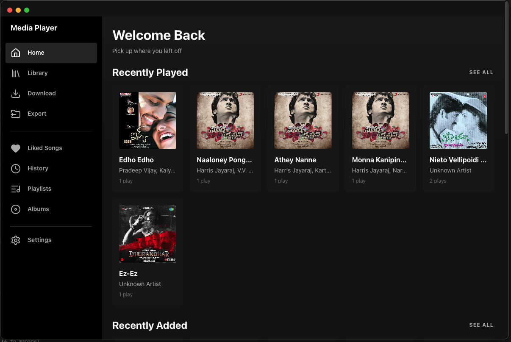
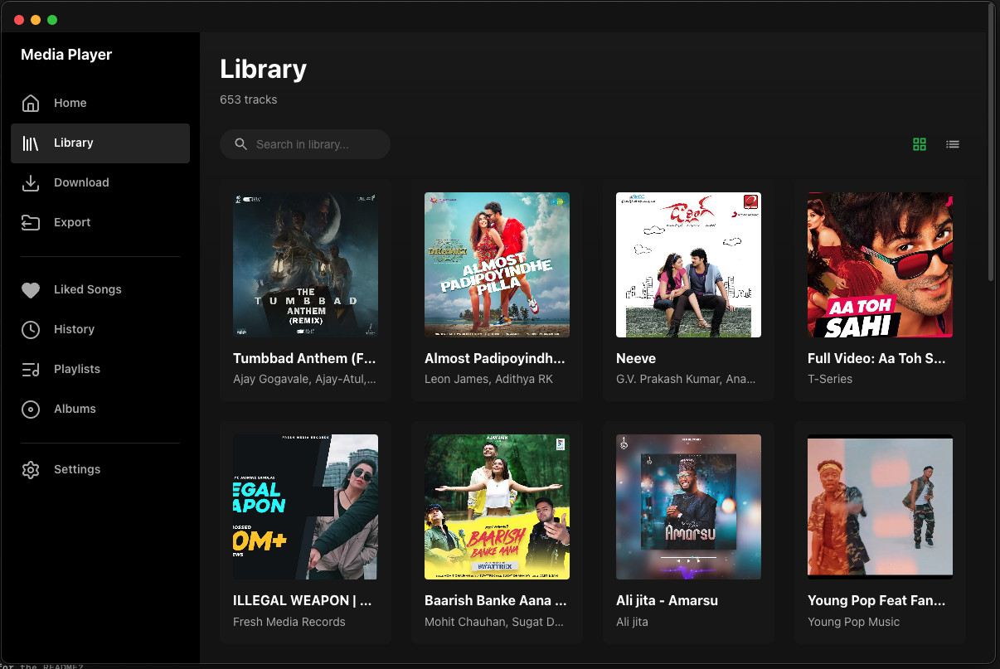
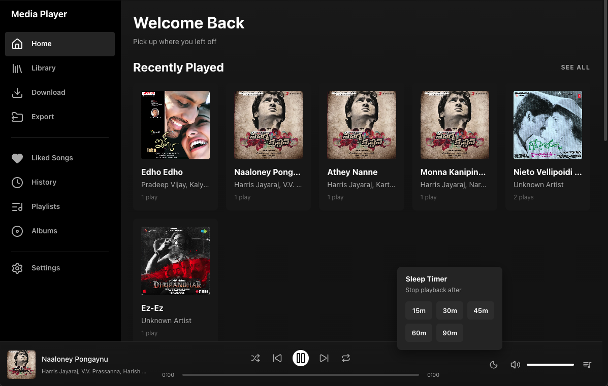
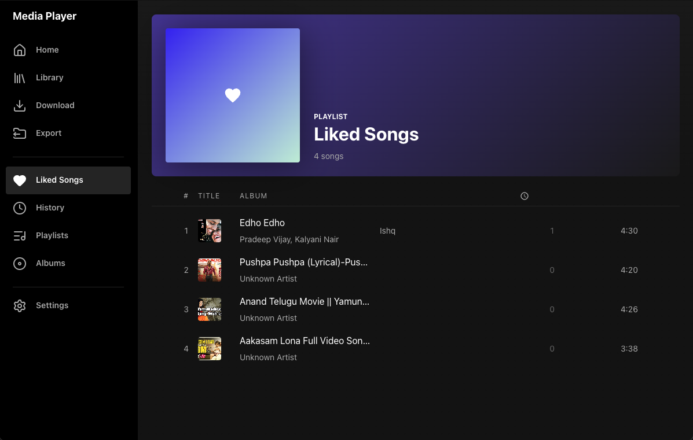
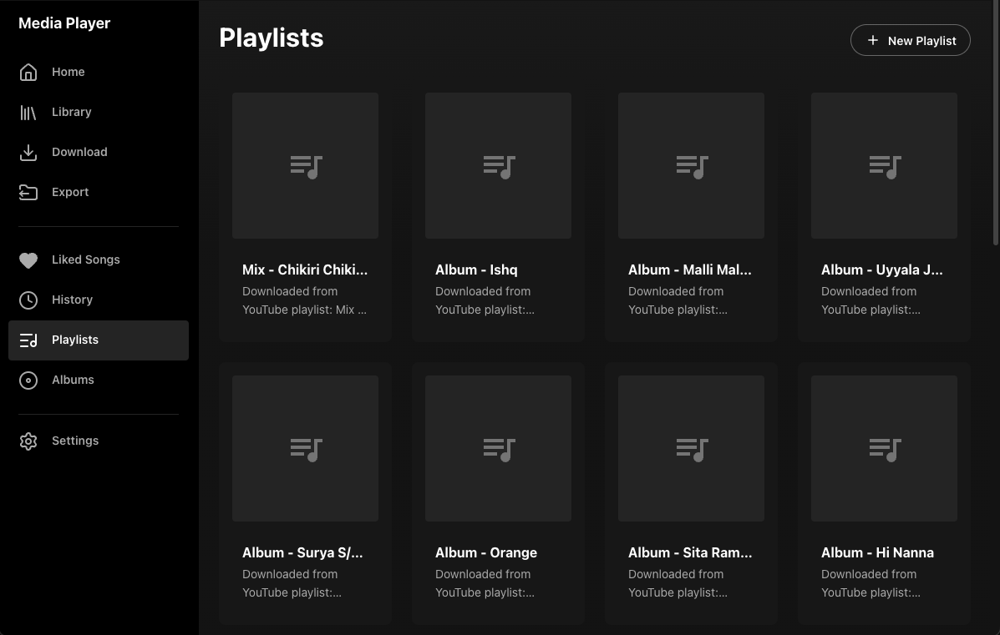
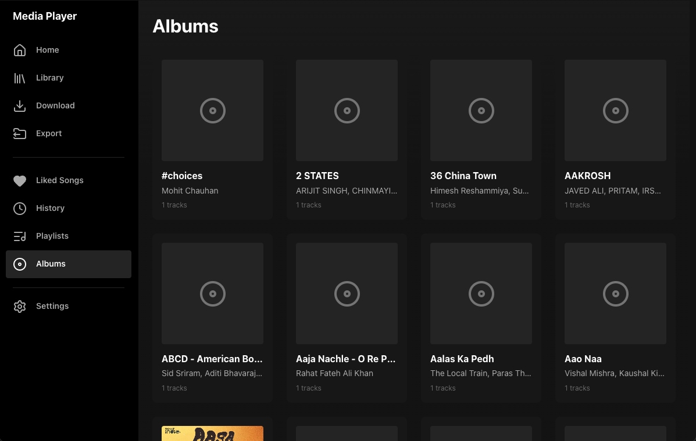
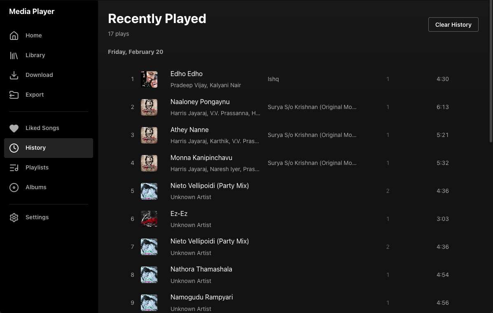
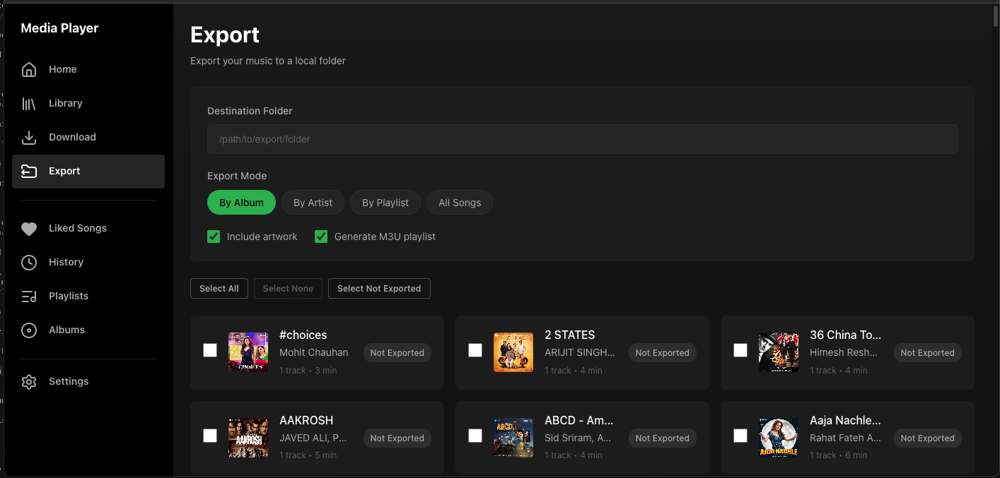

<h1 align="center">Media Player</h1>

<p align="center">
  <strong>An offline-first music player with YouTube downloads, built entirely with AI</strong>
</p>

<p align="center">
  
  
  
  
  
  
  
</p>

<p align="center">
  
</p>

<p align="center">
  <a href="#screenshots">Screenshots</a> &middot;
  <a href="#built-with-ai--the-development-story">AI Story</a> &middot;
  <a href="#features">Features</a> &middot;
  <a href="#quick-start">Quick Start</a> &middot;
  <a href="#tech-stack">Tech Stack</a>
</p>

---

## Screenshots

### Home
Welcome dashboard with **Recently Played**, **Recently Added**, and **Most Played** sections. Pick up where you left off.

<p align="center">
  
</p>

### Library
Browse your full collection in **grid or list view**. Search, sort, and filter across 650+ tracks. Toggle between views with one click.

<p align="center">
  
</p>

### Player
Full-featured player bar with **shuffle, repeat, volume controls**, and a **sleep timer** with 15m–90m presets and fade-out. Customizable keyboard shortcuts for every action.

<p align="center">
  
</p>

### Liked Songs
Spotify-style liked songs page with **gradient header**. Like any track with one click — it appears here instantly.

<p align="center">
  
</p>

### Playlists
Auto-created playlists from **YouTube playlist downloads**. Create custom playlists, reorder tracks, add/remove songs.

<p align="center">
  
</p>

### Albums
Browse by album with **artist names and track counts**. Click into any album to see its full tracklist.

<p align="center">
  
</p>

### History
**Date-grouped play history** with play counts and duration. Clear history with one click. Track your listening habits.

<p align="center">
  
</p>

### Export
Export music to local folders organized **by album, artist, or playlist**. Includes options for artwork and M3U playlist file generation.

<p align="center">
  
</p>

---

## Built with AI — The Development Story

This project was built from scratch using [Claude Code](https://docs.anthropic.com/en/docs/claude-code) — Anthropic's agentic coding tool. No boilerplate. No starter template. Every component, every endpoint, every test was authored through AI-human collaboration.

The goal: demonstrate what's possible when you combine Claude Code's agentic capabilities with well-structured instruction files and enforced quality gates.

### Claude Code Slash Commands

11 custom slash commands guided development across domains:

| Command | Domain |
|---------|--------|
| `/react` | React 19 frontend development |
| `/api` | API architecture and design |
| `/db` | PostgreSQL database operations |
| `/test` | Testing strategy and implementation |
| `/debug` | Systematic debugging |
| `/typescript` | TypeScript patterns and strict typing |
| `/devops` | Docker, CI/CD, infrastructure |
| `/a11y` | Accessibility standards |
| `/ux` | UX design and user flows |
| `/cleanup` | Code cleanup and refactoring |
| `/actions` | GitHub Actions workflows |

### AI Instruction Files

**33 domain-specific instruction files** in `.ai/` providing architectural guidance:

- **5 task checklists** — API endpoint, React component, database change, feature complete, and overview
- **28 feature specifications** — detailed specs for player, downloads, library management, platform, and UX features

### Enforced Quality Gates

Every task followed a mandatory TDD workflow, enforced by the AI instruction system:

```
1. Create test file FIRST (before any implementation)
2. Write failing tests for expected behavior
3. Implement code to make tests pass
4. Run verification gate: pnpm test && pnpm type-check && pnpm lint
5. ALL must pass before task is marked complete
```

No shortcuts. No skipping. The AI was instructed to block its own progress if tests didn't pass.

---

## Quality Metrics

| Metric | Value |
|--------|-------|
| Test cases | **576** across **35** test files |
| Coverage threshold | **80%** (statements, branches, functions, lines) |
| TypeScript | **Strict mode**, zero `any` |
| API endpoints | **67** REST endpoints |
| Database models | **8** Prisma models |
| Zustand stores | **8** state stores |
| Socket events | **27** real-time events |
| Pre-commit hooks | Husky + lint-staged + commitlint |
| Commit format | Conventional Commits enforced |

---

## Features

### Music Player
- Play/pause, next/previous track, seek forward/backward
- Queue management with shuffle and repeat modes
- Sleep timer with configurable fade-out
- Customizable keyboard shortcuts (8 actions, conflict detection)
- Volume controls with mute toggle

### Library Management
- Grid and list views with search and sort
- Like/unlike tracks
- Albums browser with detail pages
- Playlists — create, reorder, add/remove tracks
- Play history tracking
- Most played and recently added sections

### YouTube Downloads
- Single video and full playlist downloads
- Selective track picking from playlists
- Real-time progress via WebSocket (27 socket events)
- Auto-retry with exponential backoff
- Automatic playlist creation from downloaded playlists

### YouTube Sync
- Connect YouTube account via cookies
- Sync liked videos to local library
- Configurable auto-sync intervals
- Filter by category and duration
- Sync history tracking

### Export Manager
- Export music to local folders organized by album, artist, or playlist
- M3U playlist file generation
- Artwork inclusion
- Batch export with progress tracking

### Desktop App (Electron)
- Media key support (play/pause, next, previous)
- System tray integration
- Native notifications
- Cross-platform builds (macOS, Windows, Linux)
- SQLite database for standalone use

### Offline-First
- All player and library features work without internet
- Network status indicator
- Downloads only require internet during the download phase

---

## Tech Stack

| Layer | Technology |
|-------|------------|
| **Frontend** | React 19, TypeScript, Vite, Zustand, Socket.io-client, lucide-react |
| **Backend** | Node.js 18+, Express, TypeScript, Prisma ORM, Socket.io, Zod, yt-dlp |
| **Database** | PostgreSQL 15 (Docker) / SQLite (Electron) |
| **Desktop** | Electron 28, electron-vite, electron-builder, better-sqlite3 |
| **Testing** | Vitest, Testing Library, Supertest |
| **Infrastructure** | Docker Compose, pnpm monorepo, Husky, Commitlint, lint-staged |

---

## Quick Start

### Docker (recommended)

```bash
git clone https://github.com/manikumarkv/media-player.git
cd media-player
cp .env.example .env
docker-compose up
```

- Frontend: http://localhost:5173
- Backend API: http://localhost:3000

### Local Development

```bash
pnpm install
cp .env.example .env
# Edit .env — set DATABASE_URL to your local PostgreSQL instance
pnpm --filter @media-player/backend prisma migrate dev
pnpm dev
```

### Electron Desktop

```bash
pnpm electron:dev
```

Build for distribution:

```bash
pnpm electron:package:mac    # macOS
pnpm electron:package:win    # Windows
pnpm electron:package:linux  # Linux
```

---

## Project Structure

```
.
├── frontend/                  # React 19 app (Vite)
│   └── src/
│       ├── components/        # UI components (Player, Library, Export, Legal, ...)
│       ├── pages/             # Route pages (12 pages)
│       ├── stores/            # Zustand stores (8 stores)
│       ├── hooks/             # Custom hooks
│       └── api/               # API client layer
│
├── backend/                   # Express API
│   └── src/
│       ├── routes/            # REST routes (8 route files, 67 endpoints)
│       ├── controllers/       # Request handlers
│       ├── services/          # Business logic
│       └── middleware/        # Express middleware
│
├── shared/                    # Shared constants & types
│   └── src/constants/         # Routes, endpoints, socket events
│
├── electron/                  # Electron desktop app
│   └── src/
│       ├── main/              # Main process
│       └── preload/           # Preload scripts
│
├── .ai/                       # AI instruction files (33 files)
│   ├── checklists/            # Task checklists (5)
│   └── features/              # Feature specifications (28)
│
├── .claude/                   # Claude Code configuration
│   └── commands/              # Slash commands (11)
│
├── docker-compose.yml         # 3 services: postgres, backend, frontend
└── CLAUDE.md                  # AI development instructions
```

---

## Architecture

### 7-Layer Architecture

1. **Presentation** — React components, pages, UI/UX
2. **State Management** — 8 Zustand stores (player, library, download, playlist, export, keyboard, sleep timer, YouTube sync)
3. **API Client** — Axios with centralized endpoint constants
4. **API** — Express REST endpoints + Socket.io real-time events
5. **Service** — Business logic (media, playlist, download, export, YouTube sync, queue, history)
6. **Data Access** — Prisma ORM with typed queries
7. **Database** — PostgreSQL 15 (Docker) / SQLite (Electron)

### Offline-First Philosophy

All player and library features work without internet. The architecture separates online-only features (downloads, YouTube sync) from the core experience. Network status is tracked globally and surfaced in the UI.

---

## Keyboard Shortcuts

All shortcuts are customizable in Settings with conflict detection.

| Action | Default |
|--------|---------|
| Play / Pause | `Space` |
| Next Track | `Shift + Right` |
| Previous Track | `Shift + Left` |
| Seek Forward (10s) | `Right` |
| Seek Backward (10s) | `Left` |
| Volume Up | `Up` |
| Volume Down | `Down` |
| Toggle Mute | `M` |

---

## Legal Disclaimer

This software is for **educational and research purposes only**. Downloading content from YouTube may violate their Terms of Service. You are solely responsible for compliance with all applicable laws.

See [DISCLAIMER.md](./DISCLAIMER.md) for the complete legal notice.

---

## License

[GNU General Public License v3.0](./LICENSE) — modifications must remain open source.

## Acknowledgments

- [yt-dlp](https://github.com/yt-dlp/yt-dlp) — YouTube download engine
- [Prisma](https://www.prisma.io/) — Database ORM
- [Zustand](https://github.com/pmndrs/zustand) — State management
- [lucide-react](https://lucide.dev/) — Icon library
- [Claude Code](https://docs.anthropic.com/en/docs/claude-code) — AI-powered development

---

<p align="center">
  <sub>Built from idea to production with <a href="https://docs.anthropic.com/en/docs/claude-code">Claude Code</a></sub>
</p>
